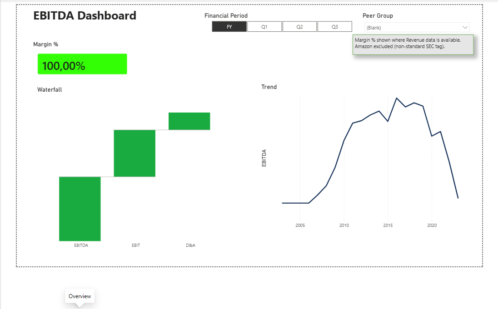
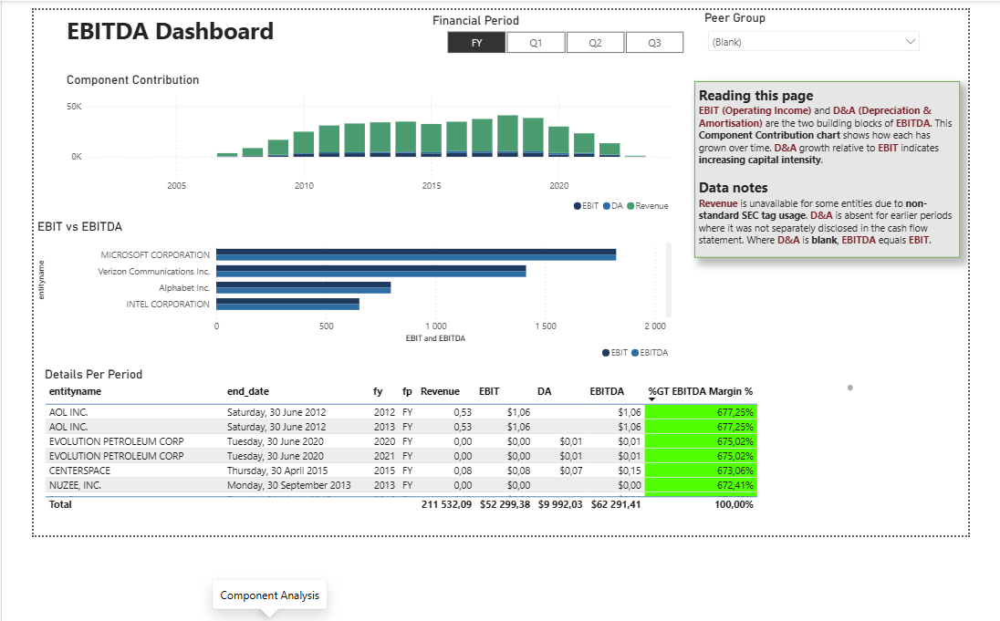
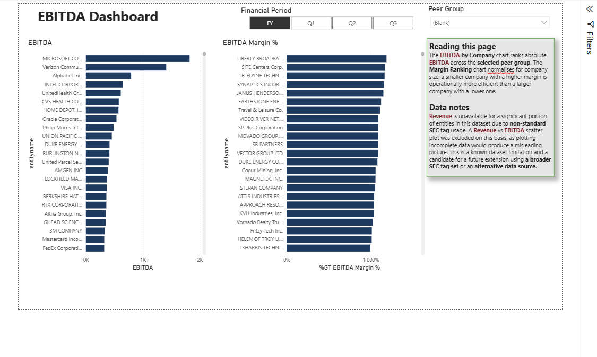
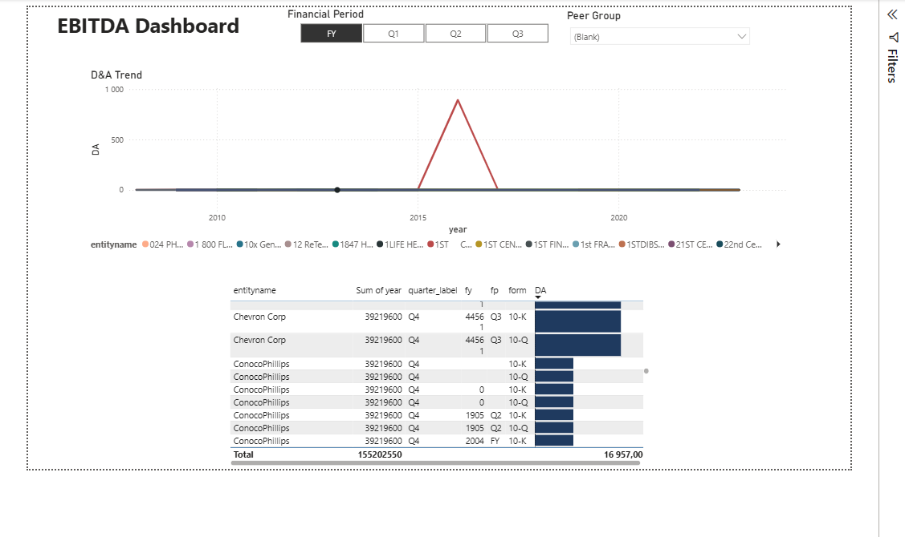

# EBITDA Power BI Dashboard

Goal: Build an EBITDA metric dashboard with transparent building blocks:
Revenue -> (COGS) -> Gross Profit -> (Opex) -> EBIT -> (+ D&A) -> EBITDA

## Repo Structure

- data/raw: original datasets (not committed)
- data/interim: cleaned intermediate outputs (not committed)
- data/processed: curated model outputs (not committed)
- sql: schema + transformation queries ✅
- powerbi: PBIX + model notes ✅
- docs: metric definitions + decisions ✅
- scripts: helper scripts ✅

## Discovery phase (completed)

- Selected SEC tags for EBITDA building blocks (staging.selected_sec_tags)
- Extracted subset from Kaggle companyfacts.csv (scripts/30_extract_companyfacts_selected.sh)
- Loaded staging.companyfacts_selected (sql/01_create_tables.sql + sql/20_copy_companyfact_selected.sql)
- Added audit + lineage stamping (sql/00_audit_tables.sql + sql/03_audit.sql + sql/04_add_lineage_cols.sql + sql/05_backfill_lineage.sql)
- Data quality checks on staging (sql/21_dq_companyfacts_selected.sql)
- End-to-end discovery runner (scripts/40_run_discovery_load.sh)

## Mart phase (completed)

- Star schema DDL: dim_company, dim_date, fct_company_period (sql/30_model_tables.sql)
- Transforms: staging → mart dimensions and fact (sql/02_transforms.sql)
- Analytics views: EBITDA components + depreciation schedule (sql/31_mart_ebitda_view.sql, sql/32_depreciation_schedule_view.sql)
- Data quality checks on mart (sql/22_dq_mart.sql)
- End-to-end mart runner (scripts/50_run_mart_load.sh)

## Scale

Counted on 7 October 2026:

| Table                         | Rows      |
| ----------------------------- | --------- |
| staging.companyfacts_selected | 3,744,533 |
| mart.fct_company_period       | 1,361,328 |
| mart.dim_company              | 13,551    |

## Documentation (completed)

- Metric definitions and governance (docs/metric_definitions.md)
- Architectural decisions log (docs/decisions.md)
- Power BI setup guide: model, relationships, DAX measures, visuals (docs/powerbi_setup.md)

## Power BI phase (completed)

- Connected to mart schema via PostgreSQL DirectQuery
- Built DAX measures: Revenue, EBIT, DA, EBITDA, EBITDA Margin %, YOY Growth, Average DA
- Four-page dashboard: EBITDA overview, component analysis, company comparison, depreciation schedule
- 39 peer-grouped companies across 8 groups using SEC EDGAR public filings data
- Exported PDF and published as portfolio piece (May 2026)

### Dashboard pages

